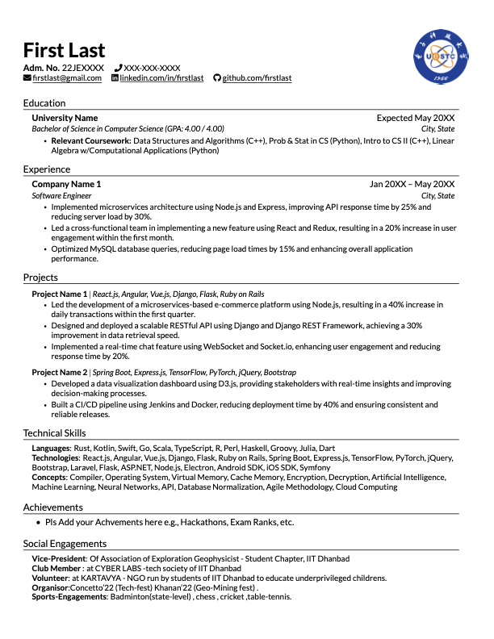
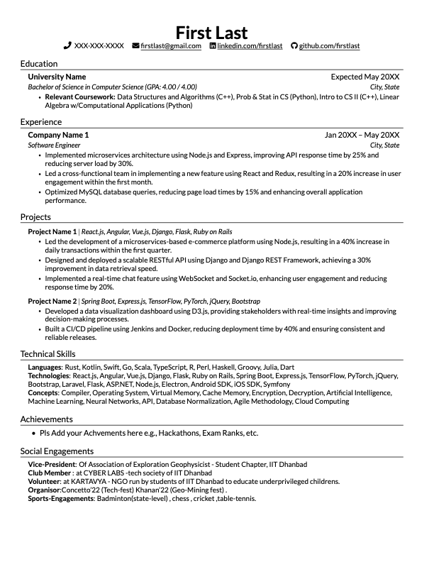

# PureCV

**PureCV** is a modern resume template based on the XeLaTeX engine, which supports generating high-quality PDF resumes. It supports multiple languages (currently English and Chinese) and comes with built-in fonts, so there's no need to install additional fonts or tools. The project uses the `make` tool for automatic compilation and cleaning, and includes a `watch_tex.sh` script that automatically rebuilds the resume when `.tex` files change.

## Preview

### Image Heading



### No Image Heading



## Features

- **Multi-language support**: The template supports both English and Chinese, and comes with custom fonts.
- **Custom fonts**: The template includes Lato and Source Han Serif fonts (for Chinese characters), which are bundled with the project.
- **Two heading styles**:
  - **Basic Heading**: A simpler version without images.
  - **Full Heading**: Includes an image in the heading.
- **Automatic build process**: The project includes a `Makefile` to automatically compile and clean using the `make` command.
- **Real-time build**: A `watch_tex.sh` script monitors `.tex` file changes and rebuilds the resume automatically.

## Installation

To use **PureCV**, first clone the project to your local machine:

```bash
git clone https://github.com/wickdynex/PureCV.git
```


Make sure you have **XeLaTeX** installed on your system. You can install it based on your OS:

- **Linux** (Debian/Ubuntu):

  ```bash
  sudo apt-get install texlive-xetex
  ```

- **macOS** (via Homebrew):

  ```bash
  brew install --cask mactex
  ```

- **Windows**: You can install **MiKTeX** or **TeX Live**.

### Prerequisites

- **XeLaTeX**: Used for compiling `.tex` files into PDF.
- **Make**: Make sure the `make` tool is installed on your system (usually pre-installed on Unix-based systems).
- **Font files**: The required font files are included in the `font/` directory.

## Usage

### Build Resume

To generate the PDF resume:

1. Open a terminal and navigate to the project directory.
2. Run `make` to build the resume.

```bash
make
```

This will generate the `resume.pdf` file in the project directory.

### Clean Build Files

If you want to clean up temporary files generated during the build process:

```bash
make clean
```

### Watch File Changes

If you'd like to automatically rebuild the resume whenever a `.tex` file changes, you can use the `watch_tex.sh` script:

```bash
./watch_tex.sh
```

This script will monitor `.tex` files in the `resume/` directory and rebuild the resume whenever a file changes.

## Customization

You can personalize your resume by modifying the following:

- **Personal Information**: Update your personal details (e.g., name, contact info) in the `resume.tex` file.
- **Resume Content**: Modify content sections (e.g., achievements, education, experience) located in the `src/` directory (e.g., `achievements.tex`, `education.tex`).
- **Heading Style**: Choose between the basic or full heading styles by including the appropriate `.tex` file in `resume.tex` (`heading_basic.tex` or `heading.tex`).

## License

This project is licensed under the MIT License. See the [LICENSE](LICENSE) file for more details.

## Inspiration

This project is inspired by the [Resume Template](https://github.com/aserador/resume-template) project. We customized and enhanced it to better support multi-language capabilities, bundled fonts, and automatic build features. Thanks to the author of the original project for their contributions to the open-source community!

---

### Notes

- **Fonts**: The fonts used in this project (Lato and Source Han Serif) are bundled within the project, so no need for additional installation.
- **Cross-platform compatibility**: The project is designed to work seamlessly on Linux, macOS, and Windows.